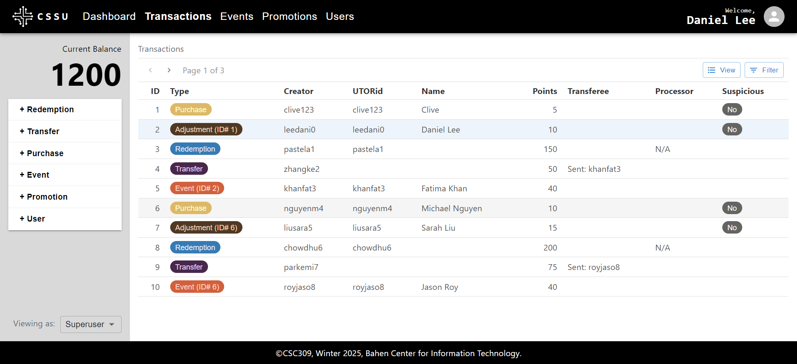
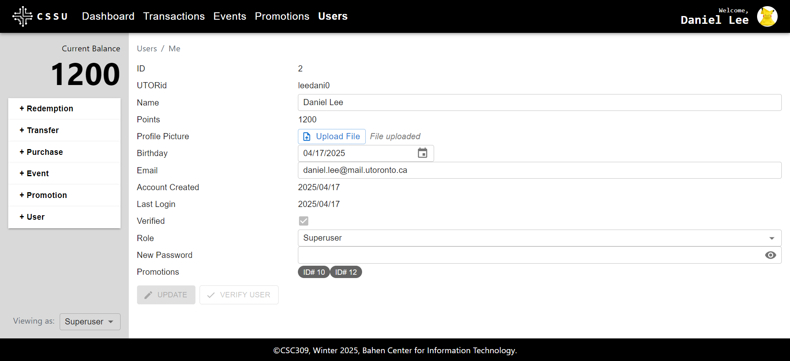

# CSC309 Term Project

A full-stack single-page application for a rewards program with an Express.js backend (and Prisma database) and React (+ Material UI) frontend.

Before running the project, make sure you have Node.js installed. You should be able to open a command line console and type `npm` and the output should be a response that tells you how to use `npm`. Then download this repository.

To run the backend,

1) Move into the `backend` directory from the command-line (with `cd ...` on Linux, `Set-Location ...` on Windows, etc.)
2) Run `npm install` to install necessary packages
3) Run `npx prisma generate` to setup the prisma database (part 1)
4) Run `npx prisma db push` to setup the prisma database (part 2)
5) Run `node prisma/seed.js` to populate the database with fake data (optional)
6) Run `node prisma/createsu.js A B C` to create a superuser with name A, email B, and password C (optional)
7) Run `node index.js`

To run the frontend,

1) Move into the `frontend` directory from the command-line
2) Run `npm install`
3) Run `npx run dev`, which should print out a URL to go to.

    

    

